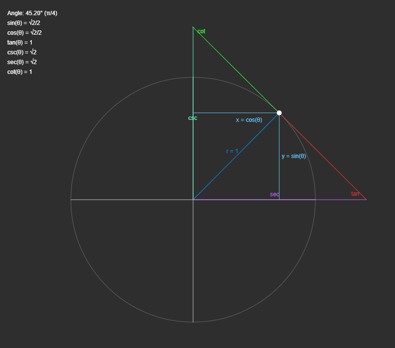

## Interactive Unit Circle Visualization

Download and open `circle.html` to explore an interactive unit circle. Drag the point around the edge of the circle to change the angle and interact with the unit circle. Special angles (30°, 45°, 60°) will display exact trigonometric values in all quadrants. 

This script, while still a work in progress, provides a helpful tool for visualizing the unit circle, angles, and trigonometric functions. Developed in collaboration with Claude and GPT, it effectively demonstrates key trigonometric concepts.

Feel free to contribute and enhance the script!

